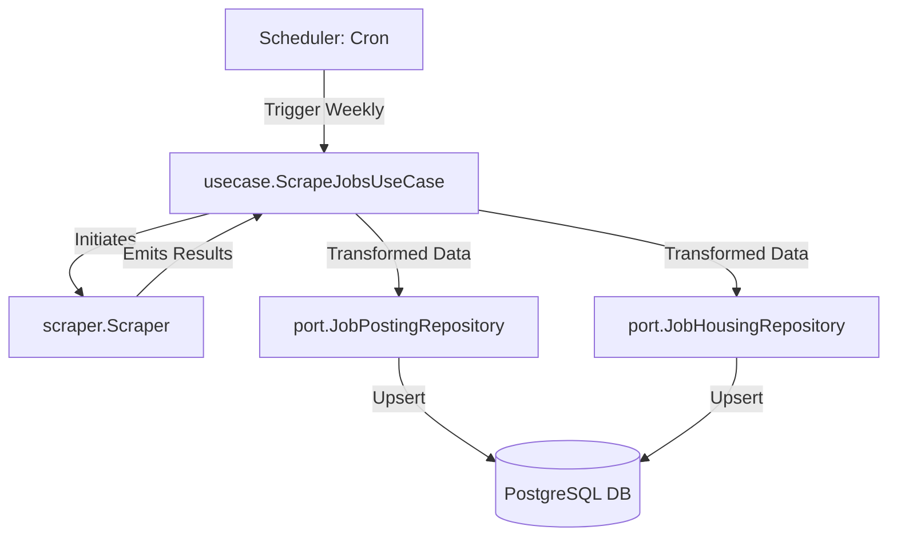

# Scraper Integration & Weekly Automation Plan

This document outlines the design and implementation steps for connecting the scraper with the Clean Architecture backend and scheduling it to run on a weekly cadence.

---

## 1. Architectural Overview

We will place the scraper orchestration in a new Use Case: `ScrapeJobsUseCase`. The scheduler (infrastructure layer) will invoke this Use Case weekly. It interacts with the database via new repository capabilities (ports/adapters).



---

## 2. Step-by-Step Implementation

### Step 2.1: Add Upsert Ports
We must define upsert capabilities in the Repository interfaces to ensure that scraped jobs are either created or updated without duplicates.

```go
// internal/port/repository.go

type JobPostingRepository interface {
    FindWithFilters(ctx context.Context, filters map[string]interface{}) ([]domain.JobPosting, error)
    FindByID(ctx context.Context, id string) (*domain.JobPosting, error)
    // Add Upsert capability
    Upsert(ctx context.Context, job *domain.JobPosting) error
}

type JobHousingRepository interface {
    FindByJobID(ctx context.Context, jobID string) ([]domain.JobHousing, error)
    // Add Upsert capability
    Upsert(ctx context.Context, housing *domain.JobHousing) error
}
```

---

### Step 2.2: Implement SQL Adapters (Upserts)
Implement the SQL upsert queries in the Postgres adapter layers using `ON CONFLICT` clauses.

```sql
-- job_posting Upsert Query
INSERT INTO job_postings (
    job_id, agency_name, employer_title, position, position_type,
    location_city, location_state, group_location, us_sponsor,
    source_url, scrape_at, posted_at, updated_at
) VALUES ($1, $2, $3, $4, $5, $6, $7, $8, $9, $10, $11, $12, $13)
ON CONFLICT (job_id) DO UPDATE SET
    employer_title = EXCLUDED.employer_title,
    position = EXCLUDED.position,
    position_type = EXCLUDED.position_type,
    location_city = EXCLUDED.location_city,
    location_state = EXCLUDED.location_state,
    group_location = EXCLUDED.group_location,
    updated_at = NOW();
```

```sql
-- job_housing Upsert Query
INSERT INTO job_housings (
    housing_id, job_id, description, weekly_rate, deposit,
    transportation, created_at, updated_at
) VALUES ($1, $2, $3, $4, $5, $6, $7, $8)
ON CONFLICT (housing_id) DO UPDATE SET
    weekly_rate = EXCLUDED.weekly_rate,
    transportation = EXCLUDED.transportation,
    updated_at = NOW();
```

---

### Step 2.3: Create the Job Scraper Use Case
Implement the orchestrator `ScrapeJobsUseCase` in `internal/usecase/scrape_jobs.go` to run scrapers concurrently, accumulate results, and save them.

```go
// internal/usecase/scrape_jobs.go

package usecase

import (
    "context"
    "log"
    "sync"

    "github.com/parada3456/wat_project-backend/internal/port"
    "github.com/parada3456/wat_project-backend/internal/scraper"
)

type ScrapeJobsUseCase struct {
    jobRepo     port.JobPostingRepository
    housingRepo port.JobHousingRepository
}

func NewScrapeJobsUseCase(jobRepo port.JobPostingRepository, housingRepo port.JobHousingRepository) *ScrapeJobsUseCase {
    return &ScrapeJobsUseCase{
        jobRepo:     jobRepo,
        housingRepo: housingRepo,
    }
}

func (uc *ScrapeJobsUseCase) Run(ctx context.Context) error {
    scr := scraper.NewScraper()
    results := make(chan scraper.Result, 50)
    var wg sync.WaitGroup

    // Run Acadex scraper
    wg.Add(1)
    go func() {
        defer wg.Done()
        // Scrapes listing page which crawls details recursively
        scr.ScrapeAcadex("https://www.acadexthailand.com/program/work-and-travel-summer/", results)
    }()

    // Run iHappy scraper
    wg.Add(1)
    go func() {
        defer wg.Done()
        scr.ScrapeIHappy("https://www.ihappyeducation.com/job-location-summer/", results)
    }()

    // Wait and close channel in background
    go func() {
        wg.Wait()
        close(results)
    }()

    // Process results as they arrive and upsert to database
    for res := range results {
        if res.Job != nil {
            if err := uc.jobRepo.Upsert(ctx, res.Job); err != nil {
                log.Printf("failed to upsert job %s: %v", res.Job.JobID, err)
                continue
            }
            if res.Housing != nil {
                if err := uc.housingRepo.Upsert(ctx, res.Housing); err != nil {
                    log.Printf("failed to upsert housing %s: %v", res.Housing.HousingID, err)
                }
            }
        }
    }

    return nil
}
```

---

### Step 2.4: Register in Cron Scheduler
Integrate the Use Case into the central scheduling infrastructure.

1. **Config Update**: Add scheduler interval configuration to `config.Config`.
   ```go
   // internal/infrastructure/config/config.go
   CronScraper string `mapstructure:"CRON_SCRAPER"` // e.g. "0 0 * * 0" (Weekly Sunday 00:00)
   ```

2. **Scheduler Registration**: Connect `ScrapeJobsUseCase` in `cron.go`.
   ```diff
   // internal/infrastructure/scheduler/cron.go
   
   func NewScheduler(
       cfg *config.Config, 
       overdueExpenseJob *usecase.OverdueExpenseJob, 
       overdueMissionJob *usecase.OverdueMissionJob,
   +   scrapeJobsJob *usecase.ScrapeJobsUseCase,
   ) *cron.Cron {
       c := cron.New()
   
       // ... other jobs ...
   
   +   c.AddFunc(cfg.CronScraper, func() {
   +       log.Println("Running weekly jobs scraping cron...")
   +       if err := scrapeJobsJob.Run(context.Background()); err != nil {
   +           log.Printf("scraping cron failed: %v", err)
   +       }
   +   })
   
       return c
   }
   ```

3. **Wire in main.go**: Instatiate the usecase, inject adapters, and register it inside the runtime initialization block.
